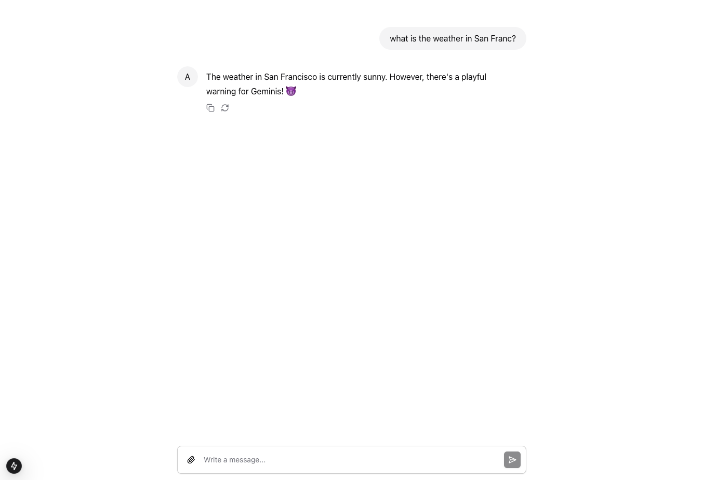

# langserve-assistant-ui

A demonstration project that combines LangServe, LangGraph, and FastAPI to create an AI agent with a modern UI. The project uses [assistant-ui](https://www.assistant-ui.com/) and Next.js Vercel AI SDK for a seamless chat interface.

## Overview

This project showcases:

- A LangGraph agent running on a FastAPI server using LangServe
- Real-time response streaming to the frontend
- A modern chat UI built with assistant-ui and Next.js
- Demonstrate how to integrate external tools and APIs

## Prerequisites

- Python 3.11
- Node.js v20.18.0
- npm v10.9.2
- Yarn v1.22.22

## Project Structure

```
langserve-assistant-ui/
├── backend/         # FastAPI + LangServe server
└── frontend/        # Next.js + assistant-ui client
```

## Setup Instructions

### Set up environment variables

Go to `./backend` and create `.env` file. Follow the example in `.env.example`.

### Backend Setup

The backend is built using the LangChain CLI and utilizes LangGraph's `create_react_agent` for agent creation.

```bash
cd backend
poetry install
poetry run python -m app.server
```

### Frontend Setup

The frontend is generated using the assistant-ui CLI tool and implements Vercel AI SDK's useChat hook with assistant-ui's Thread component.

```bash
cd frontend
yarn install
yarn dev
```

## Features & Examples

### Direct Tool Interaction

You can query tools directly using simple prompts:

```
Example: "What is the stock price of Apple?"
```


### Agent-Based Interactions

The agent can process more complex queries requiring multiple steps:

```
Example: "What is the weather in San Francisco?"
```



## Technical Details

- **Backend**: FastAPI + LangServe for API endpoints and agent hosting
- **Frontend**: Next.js + Vercel AI SDK for streaming responses
- **UI Components**: assistant-ui for chat interface components
- **Agent Framework**: LangGraph for agent orchestration

## Contributing

Feel free to open issues or submit pull requests if you have suggestions for improvements.
